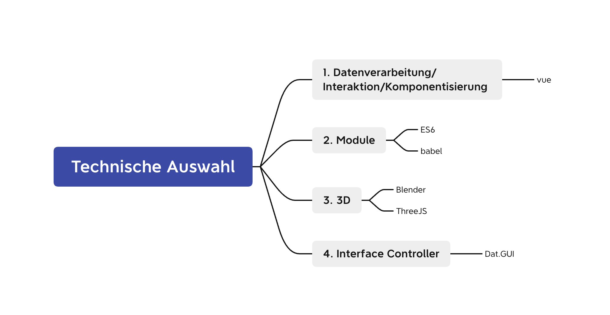

# 3D Web

# First 3D Web

## 1. Projektbeschreibung
3D Websites sind neuerdings im Trend. Das ist mein erster Versuch mit ThreeJS. Beschreibungen:

1. Dieses Projekt ist eine 3D-Music-App 

2. Man kann mit dat.gui die Musikkugel kontrollieren. wie zum Beispiel die Musikkugel kann sich mit der Mausbewegung bewegen, oder mit default Controller. Sphere Pillards, Spectrum Folder u.s.w. können alle kontrolliert werden.

3. Wenn man die Musik spielt, wird die Flamme im Rhythmus der Musik tanzen.

4. Verwenden Sie die neuesten und heißesten Front-End-Technologien wie ThreeJS.

## 2. Projektfunktionsschnittstelle

  

  Beschreibung: Voll funktionsfähige Schnittstelle zum Ausführen der endgültigen Version des Projekts

## 3. Technische Auswahl

## 4. Prozess

[zur Website](https://first-3d-web.netlify.app/)

